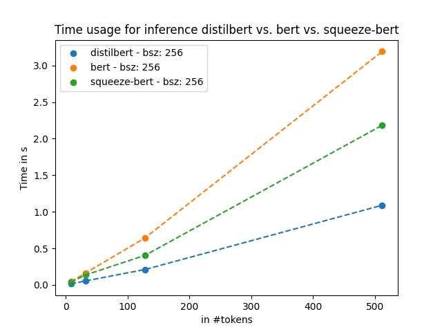
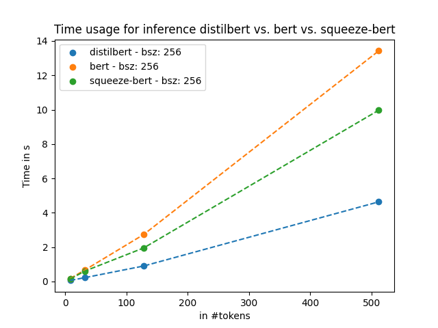
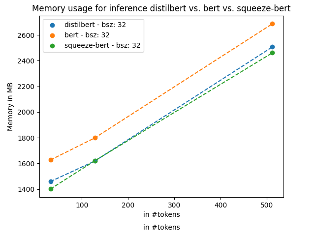
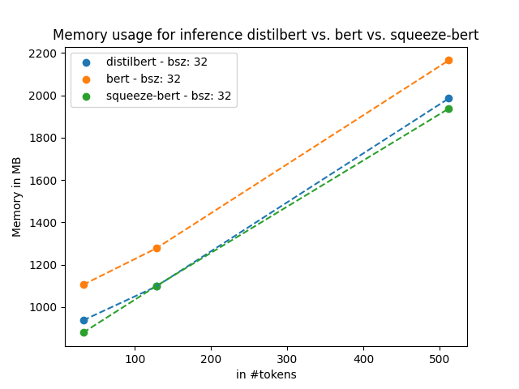
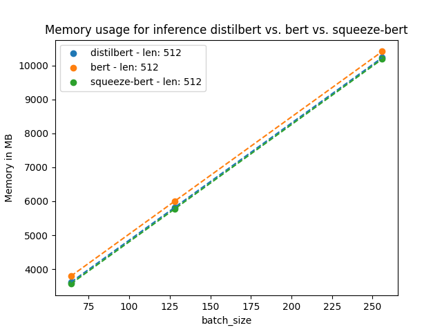
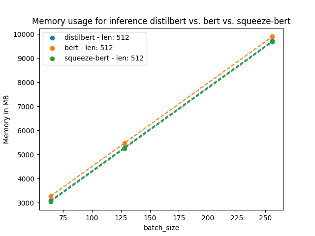

# Benchmarking-Transformers

## Final Project for COMSE6998 Practical Deep Learning System Performance Fall 2021

### Contributers :
#### Supriya Arun (sa3982) 
#### Arvind Kanesan Rathna (ak4728)


## Summary 

Comparison, benchmarking and analysis of performance metrics for three transformer models BERT, DistilBert, and SqueezeBERT. We evaluate tradeoffs in accuracy, computational requirements, and dollar cost on Question and Answering (SQuAD benchmark). 

## Running the Code 

### Step 1 : Hugging Face Setup 

Install the huggingface_hub library with pip in your environment:

```

python -m pip install huggingface_hub

```

Once you have successfully installed the huggingface_hub library, log in to your Hugging Face account:

```
huggingface-cli login
```
Login with the token you can get on your hugging face account. 

### Step 2 : Install Dependencies 

Install the required dependencies in the the requirements.txt file 

### Step 3 : Run Training Code 

```
python trianing.py

```

The training code will run with the following default parameters : 

model_checkpoint = "distilbert-base-uncased"
batch_size = 16
epochs = 3

Change these as required. 

Once the training is finished your model will be uploaded to the hugging face Model Hub. 


# Benchmarking

## Installation

```
$ pip install -q git+https://github.com/huggingface/transformers.git
```

## Memory consumption benchmarking

* Here, we will benchmark the memory consumption of the 3 finetuned models for varying sequence lengths (32, 128, 512, 1024) while maintaing a constant batch size of 32
    * The memory consumption is measured in the same way as the nvidia-smi measures GPU memory usage
    * Note that we pull the models from the model hub where we had just uploaded (SupriyaArun/distilbert-base-uncased-finetuned-squad, SupriyaArun/bert-base-uncased-finetuned-squad, SupriyaArun/squeezebert-uncased-finetuned-squad)
    * The memory consumption results are saved to `benchmark_results/required_memory.csv`
    * The environment used for benchmarking is saved to `benchmark_results/env.csv`.
    * The plot is saved to `plots_pt/required_memory_plot.png`.
```
$ mkdir benchmark_results plots_pt
$ python run_benchmark.py --no_speed --save_to_csv \
                                --models SupriyaArun/distilbert-base-uncased-finetuned-squad \
                                SupriyaArun/bert-base-uncased-finetuned-squad \
                                SupriyaArun/squeezebert-uncased-finetuned-squad \
                                --sequence_lengths 32 128 512 1024 \
                                --batch_sizes 32 \
                                --inference_memory_csv_file benchmark_results/required_memory.csv \
                                --env_info_csv_file benchmark_results/env.csv
$ python plot_csv_file.py --csv_file benchmark_results/required_memory.csv --figure_png_file=plots_pt/required_memory_plot.png --no_log_scale --short_model_names distilbert bert squeeze-bert
```

* Next, we will benchmark the memory consumption of the 3 finetuned models for varying batch sizes (64, 128, 256, 512) while maintaing a constant sequence length (512).
    * In our experiments we observed that both K80 and P100 error out for batch sizes >= 512

```
$ python run_benchmark.py --no_speed --save_to_csv \
                                --inference_memory_csv_file benchmark_results/required_memory_2.csv \
                                --env_info_csv_file benchmark_results/env.csv \
                                --models SupriyaArun/distilbert-base-uncased-finetuned-squad \
                                SupriyaArun/bert-base-uncased-finetuned-squad \
                                SupriyaArun/squeezebert-uncased-finetuned-squad \
                                --sequence_lengths 512 \
                                --batch_sizes 64 128 256 512\

$ python plot_csv_file.py --csv_file benchmark_results/required_memory_2.csv \
                          --figure_png_file=plots_pt/required_memory_plot_2.png \
                          --no_log_scale \
                          --short_model_names distilbert bert squeeze-bert \
                          --plot_along_batch
```

## Inference Time Benchmarking

* We find the inference time for varying sequence lengths (8 32 128 512) while maintaning a constant batch size of 256
```
$ python run_benchmark.py  --no_memory --save_to_csv \
                          --inference_time_csv_file benchmark_results/time.csv \
                          --env_info_csv_file benchmark_results/env.csv \
                          --models SupriyaArun/distilbert-base-uncased-finetuned-squad \
                          SupriyaArun/bert-base-uncased-finetuned-squad \
                          SupriyaArun/squeezebert-uncased-finetuned-squad \
                          --sequence_lengths 8 32 128 512 \
                          --batch_sizes 256 \
$ python plot_csv_file.py --csv_file benchmark_results/time.csv \
                    --figure_png_file=plots_pt/time_plot.png --no_log_scale \
                    --short_model_names distilbert bert squeeze-bert --is_time
```

## Results & Observations

### Inference Time

* P100 GPU:



* K80 GPU:



* For all GPUs and sequence lengths
    * Performance: DistilBERT < SqueezeBERT < BERT
* Between GPUs: P100 is roughly 4x faster than K80 for all models
* We observe an almost linear scaling with increasing input token size
* DistilBERT is roughly 65% faster than BERT
    * Validates paper’s claim of 60%
* DistilBERT is roughly 50% faster than SqueezeBERT
* For lowest inference time, we should choose DistilBERT
* SqueezeBERT’s claims being 4x faster than BERT in pixel4 device is not observed in GPUs

### Memory Consumption

* P100 GPU: (Batch size constant at 32)



* K80 GPU: (Batch size constant at 32)



* P100 GPU: (Input token size constant at 512)



* K80 GPU: (Input token size constant at 512)



* With increasing batch size and increasing token size, the GPU memory requirements also increase almost linearly
* Memory footprint: SqueezeBERT < DistilBERT < BERT
* SqueezeBERT is only marginally lower memory comsumption than DistilBERT
* Both GPUs do not have sufficient memory to support 512 batch size (max – 256)

* References:

1. [BERT : Pre-training of Deep Bidirectional Transformers for Language Understanding ](https://arxiv.org/abs/1810.04805)
2. [DistilBERT : a distilled version of BERT, smaller, faster, cheaper and lighter](https://arxiv.org/abs/1910.01108)
3. [Squeeze BERT : What can computer vision teach NLP about efficient neural networks?](https://arxiv.org/abs/2006.11316)
4. [Hugging Face Documentation](https://huggingface.co/docs)